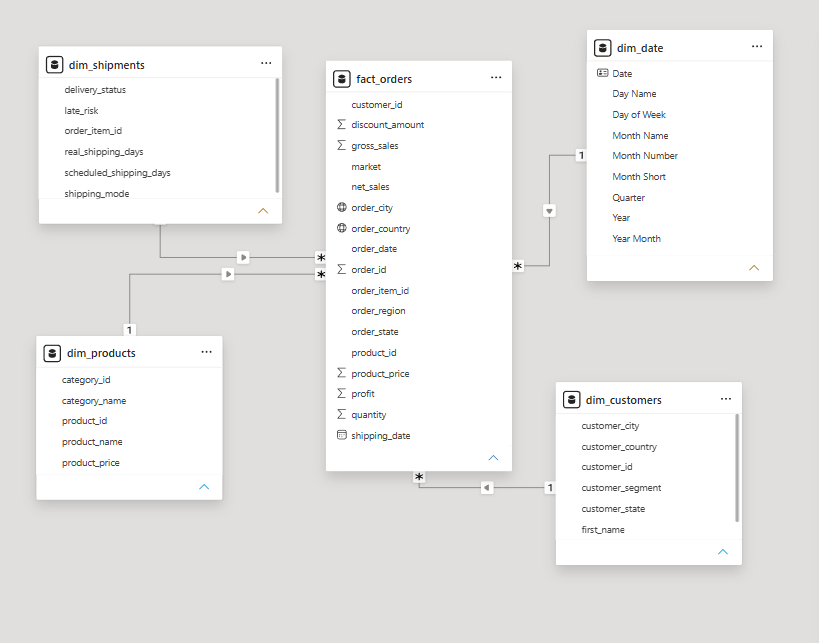
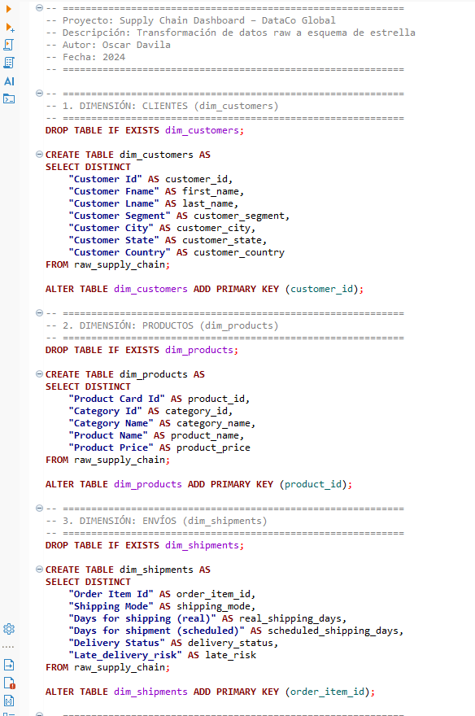
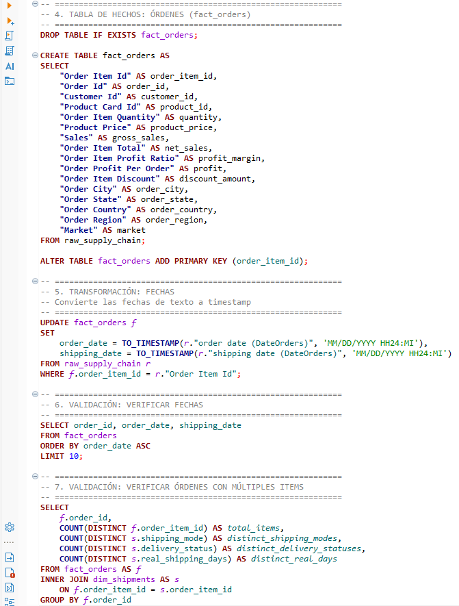
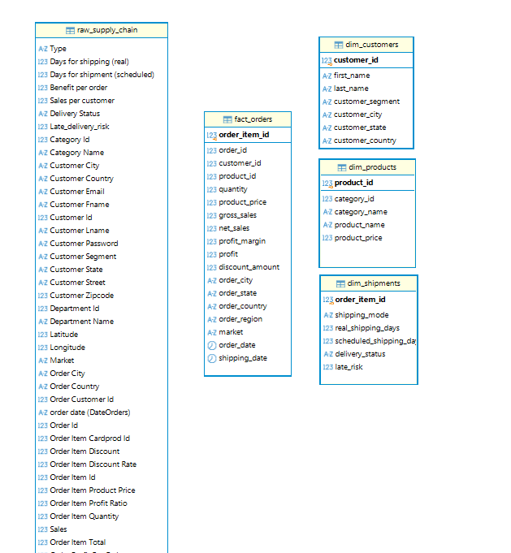
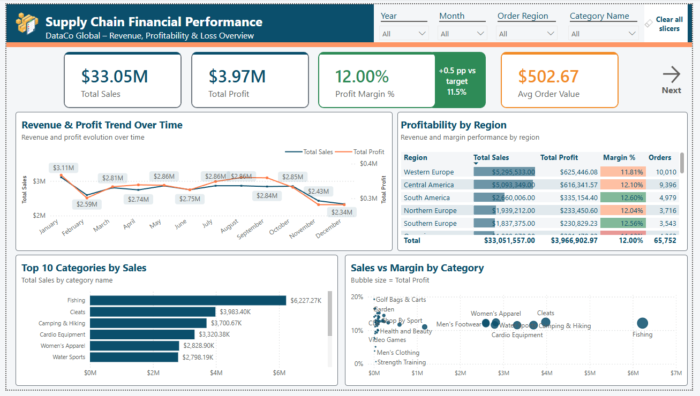
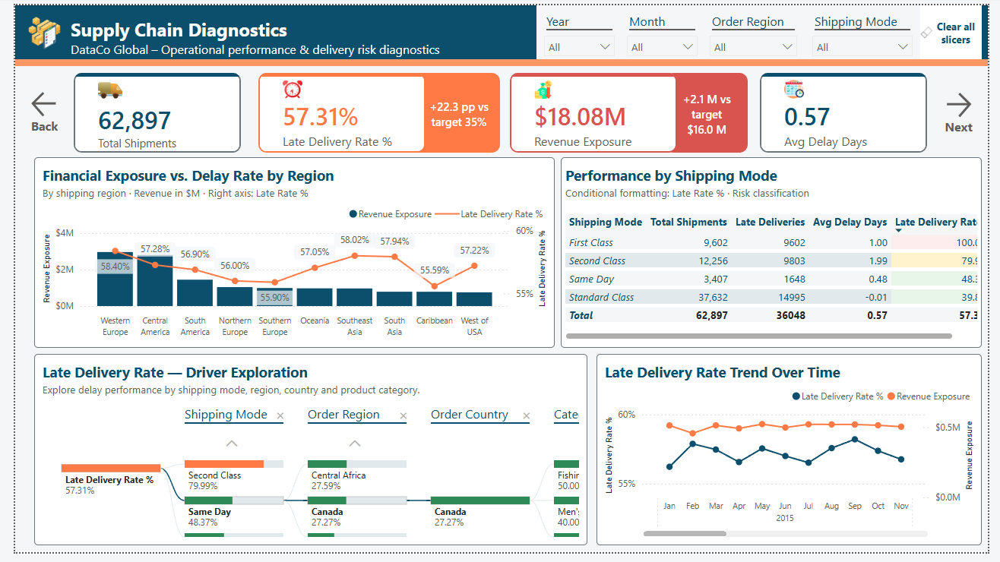

# supply-chain-dashboard
"Supply chain financial and operational dashboard built with Power BI. Analyzes delivery risks, financial impact of delays, and optimization opportunities."

# Supply Chain Analytics & Operational Diagnostics — DataCo Global


## Project Overview

This project analyzes the financial and operational performance of a global supply chain using PostgreSQL and Power BI.

The analysis goes beyond a traditional sales dashboard by combining financial performance with delivery risk diagnostics. The objective was to identify operational bottlenecks, understand where delivery performance is weakest, and quantify the amount of revenue associated with delayed shipments.

The final Power BI report contains three pages:

1. **Financial Performance** — Revenue, profitability and loss analysis.
2. **Supply Chain Diagnostics** — Shipment performance, delivery risk and financial exposure.
3. **Conclusions & Recommendations** — Key findings and recommended actions based on the analysis.

---

## Business Questions

The analysis was designed around the following questions:

- How is the business performing financially?
- Which regions and product categories contribute most to revenue and profitability?
- How significant is the late-delivery problem?
- Which shipping modes present the highest delivery risk?
- Which regions have the highest financial exposure associated with delayed shipments?
- Which operational areas should be prioritized for further investigation?

---

## Dataset

The project uses the **DataCo Smart Supply Chain for Big Data Analysis** dataset.

**Source:** [DataCo Smart Supply Chain — Kaggle](https://www.kaggle.com/datasets/shashwatwork/dataco-smart-supply-chain-for-big-data-analysis)

The dataset contains approximately **180,000 records** covering sales, orders, customers, products and shipping information.

Relevant fields include:

- `order_id`
- `order_item_id`
- `net_sales`
- `shipping_mode`
- `real_shipping_days`
- `scheduled_shipping_days`
- `delivery_status`
- `late_risk`
- `order_region`
- `order_country`
- `category_name`

---

## Tools & Technologies

- **PostgreSQL** — Data preparation, transformation and relational modeling.
- **SQL** — Data extraction, filtering, aggregation and joins.
- **Power BI Desktop** — Data modeling, visualization and interactive reporting.
- **DAX** — Business measures and KPI calculations.
- **Figma** — Supporting visual assets used in the report design.

---

## Data Model & Granularity

The project uses a star-schema-oriented model with a central `fact_orders` table and supporting dimensions.

### Data Model



The `fact_orders` table is stored at **order-item level**. This means that a single `order_id` can contain multiple `order_item_id` records.

For example:

Order 1001
- Order Item A
- Order Item B
- Order Item C

This distinction was important when defining the analytical measures:

- Operational order/shipment metrics use `DISTINCTCOUNT(order_id)` when the analysis is performed at order level.
- Financial metrics aggregate `net_sales` at the order-item level.
- Logistics attributes are connected through `order_item_id`.

Understanding the grain of the fact table helped prevent double-counting when calculating operational KPIs.

---

## Data Preparation

The original dataset was loaded into PostgreSQL and transformed into a relational analytical structure before being imported into Power BI.

The workflow was:

Raw Dataset -> PostgreSQL -> Data Cleaning & Transformation -> Relational / Star-Schema Model -> Power BI Data Model -> DAX Measures -> Interactive Dashboard

### SQL Transformation Script

,


### PostgreSQL Schema



The SQL transformation scripts used for the project are available in:

/sql/transform.sql
---

## Analytical Approach

The report separates the analysis into two main perspectives:

### Financial Performance

The first page focuses on:

- Total Sales
- Total Profit
- Profit Margin
- Average Order Value
- Sales and profit trends
- Regional profitability
- Top-performing product categories
- Sales vs. margin relationships

### Operational Diagnostics

The second page focuses on:

- Total Shipments
- Late Delivery Rate
- Average Shipping Delay
- Revenue Exposure
- Delivery performance by shipping mode
- Regional financial exposure
- Exploration of potential drivers of late deliveries

Operational KPIs exclude canceled shipments because canceled orders do not represent completed delivery outcomes.

---

## Key DAX Measures

The project includes DAX measures for financial performance, profitability and supply chain operations.

### Total Sales

```
Total Sales =
SUM(fact_orders[net_sales])

Total Shipments =
CALCULATE(
    DISTINCTCOUNT(fact_orders[order_id]),
    dim_shipments[delivery_status] <> "Shipping canceled"
)

Late Deliveries =
CALCULATE(
    DISTINCTCOUNT(fact_orders[order_id]),
    dim_shipments[late_risk] = 1,
    dim_shipments[delivery_status] <> "Shipping canceled"
)

Late Delivery Rate % =
DIVIDE(
    [Late Deliveries],
    [Total Shipments],
    0
)

Revenue Exposure
Revenue Exposure represents net sales associated with shipments flagged as late-risk, excluding canceled shipments.

Revenue Exposure =
CALCULATE(
    SUM(fact_orders[net_sales]),
    dim_shipments[late_risk] = 1,
    dim_shipments[delivery_status] <> "Shipping canceled"
)
```

## Dashboard

### Page 1 — Financial Performance



The first page provides an executive overview of financial performance.

**Main KPIs**

| KPI | Value |
| :--- | :--- |
| Total Sales | $33.05M |
| Total Profit | $3.97M |
| Profit Margin | 12.00% |
| Average Order Value | $502.67 |

The page combines financial trends, regional profitability and category-level performance to provide a high-level view of the business.

### Page 2 — Supply Chain Diagnostics



This page focuses on delivery performance and operational risk.

**Main KPIs**

| KPI | Value |
| :--- | :--- |
| Total Shipments | 62,897 |
| Late Delivery Rate | 57.31% |
| Average Delay | 0.57 days |
| Revenue Exposure | $18.08M |

The page allows users to investigate delivery performance by:

- Shipping Mode
- Region
- Country
- Product Category

A decomposition tree is used as an interactive driver exploration tool rather than as proof of causal relationships.

### Page 3 — Conclusions & Recommendations


The final page translates the analytical findings into business-oriented conclusions and recommendations.

**Key Findings**

1. **First Class shows the highest delivery risk**
   First Class recorded a 100% late-delivery rate in the analyzed data, making it the highest-risk shipping mode and a priority for further investigation.

2. **Western Europe combines strong financial performance with significant exposure**
   Western Europe generated approximately $5.29M in sales with an 11.81% profit margin, while also showing approximately $1.8M in revenue exposure associated with delayed shipments.

3. **Standard Class shows the lowest late-delivery rate**
   Standard Class handled the largest shipment volume and recorded a 39.85% late-delivery rate, the lowest among the shipping modes analyzed.

**Recommendations**

The report proposes actions focused on:

- Investigating First Class routes, providers and delivery commitments.
- Prioritizing high-exposure regions for operational review.
- Examining whether practices associated with better-performing shipping modes can be replicated.
- Implementing earlier monitoring of shipments with elevated delivery risk.
- Reviewing cancellation patterns to understand potential operational losses.

---

## Validation & Analytical Considerations

During development, the data model and measures were validated to ensure that the analytical results matched the underlying data structure.

One important finding was that the fact table contains multiple records for the same `order_id` because orders can contain multiple order items.

This distinction affects how metrics should be calculated:

- **Order / Shipment volume** -> `DISTINCTCOUNT(order_id)`
- **Financial metrics** -> `SUM(net_sales)`

This helped reduce the risk of inflated operational KPIs caused by counting order-item rows as individual orders.

The project also excludes canceled shipments from operational delivery KPIs.

---

## Project Structure

```text
supply-chain-dataco/
|
|-- README.md
|
|-- dashboard/
|   |-- Supply_Chain_Dashboard.pbix
|
|-- scripts/
|   |-- transform.sql
|   |-- measures.dax
|
|-- images/
    |-- data_model.png
    |-- page-1-financial-performance.png
    |-- page-2-supply-chain-diagnostics.png
    |-- page-3-conclusions-recommendations.png
```
## How to Explore the Project

### Power BI

The `.pbix` file is included for inspection:

/dashboard/Supply_Chain_Dashboard.pbix

Open the file using Power BI Desktop.

Depending on the local environment, the PostgreSQL data-source connection may need to be updated before refreshing the model.

### SQL

The PostgreSQL transformation logic is available in:

/script/transform.sql


### DAX

The main DAX measures are documented in:

/script/measures.dax


---

## Limitations

This project uses a public dataset originally created for supply chain analysis and does not represent a real company's internal operational data.

The analysis identifies patterns and areas for investigation, but the dashboard should not be interpreted as proving causal relationships between logistics variables and late deliveries.

Revenue Exposure is used as a proxy for the amount of net sales associated with delayed shipments; it should not be interpreted as confirmed lost revenue.

---

## About the Project

This project was developed as part of my transition into Data Analytics / BI, with a focus on practical skills in SQL, Power BI, DAX, data modeling and business-oriented analysis.

The goal was not only to create an interactive dashboard, but to develop an analytical workflow from raw data through transformation, modeling, metric definition, visualization and business recommendations.

---

## Contact

**Oscar Davila**

- LinkedIn: [Your LinkedIn](https://www.linkedin.com/in/your-profile)
- GitHub: [Your GitHub](https://github.com/oscardavila-data/)
- Email: [your-professional-email@example.com](oscar.davilaenriquez@gmail.com)

---

## Dataset Attribution

**DataCo Smart Supply Chain for Big Data Analysis**

- [Kaggle Dataset](https://www.kaggle.com/datasets/shashwatwork/dataco-smart-supply-chain-for-big-data-analysis)
